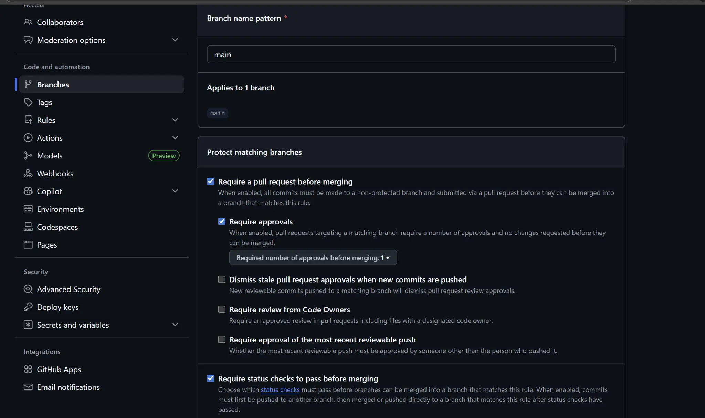

# FastFoodGo - Projet DevOps Python

Projet d'application des principes DevOps à une application Python. Inclut tests unitaires (pytest), packaging (pyproject.toml), intégration continue (GitHub Actions) et protection de branche.

## 1. Contexte du Projet

Ce projet s'inscrit dans le cadre d'un exercice DevOps visant à industrialiser une application Python simple. L'objectif est de mettre en place un pipeline de développement robuste et automatisé, garantissant la qualité et la stabilité du code.

## 2. Structure du Repository

Le projet est organisé de la manière suivante pour suivre les meilleures pratiques de développement Python :

```
fastfoodgo-devops-project/
├── .github/
│   └── workflows/
│       └── ci.yml          # Workflow d'intégration continue
├── src/
│   ├── __init__.py
│   └── commande.py         # Fonctions métier
├── tests/
│   └── test_commande.py    # Tests unitaires
├── .gitignore
├── pyproject.toml          # Fichier de packaging
└── README.md
```

## 3. Installation et Utilisation

### Prérequis

- Python 3.8+
- Git

### Installation

1.  **Clonez le repository :**

    ```bash
    git clone https://github.com/YobeGnadame/fastfoodgo-devops-project.git
    cd fastfoodgo-devops-project
    ```

2.  **Créez un environnement virtuel (recommandé) :**

    ```bash
    python -m venv .venv
    source .venv/bin/activate  # Sur Windows: .venv\Scripts\activate
    ```

3.  **Installez les dépendances :**

    Le projet utilise `pyproject.toml` pour la gestion des dépendances. Installez-les avec la commande suivante, qui inclut les dépendances de développement (`[dev]`) :

    ```bash
    pip install -e ".[dev]"
    ```

## 4. Lancer les Tests

Les tests unitaires sont écrits avec `pytest`. Pour les exécuter, lancez simplement la commande suivante à la racine du projet :

```bash
pytest
```

Vous pouvez également lancer les tests avec la couverture de code pour voir quelles parties du code sont testées :

```bash
pytest --cov=src
```

## 5. Intégration Continue (CI)

Ce projet utilise **GitHub Actions** comme système d'intégration continue. Le workflow est défini dans le fichier `.github/workflows/ci.yml`.

### Ce que le workflow garantit :

1.  **Tests Automatisés :** À chaque `push` ou `pull request` sur les branches `main` et `develop`, le workflow se déclenche automatiquement.
2.  **Tests Multi-Versions :** Les tests sont exécutés sur plusieurs versions de Python (3.8, 3.9, 3.10, 3.11) pour garantir la compatibilité.
3.  **Qualité du Code :** Des vérifications de *linting* (`flake8`) et de formatage (`black`, `isort`) sont effectuées pour maintenir un code propre et cohérent.
4.  **Couverture de Code :** Le rapport de couverture de code est généré et envoyé à Codecov pour suivre l'évolution de la qualité des tests.

Un badge d'état du workflow est affiché en haut de ce README pour indiquer si la dernière exécution a réussi ou échoué.

## 6. Gouvernance Git : Protection de la Branche `main`

Pour assurer la stabilité de la branche principale, des règles de protection ont été mises en place. Toute modification sur la branche `main` doit respecter les conditions suivantes :

1.  **Pull Request Obligatoire :** Les modifications ne peuvent pas être poussées directement sur `main`. Elles doivent passer par une Pull Request.
2.  **Tests au Vert :** Le workflow d'intégration continue doit s'exécuter avec succès. La fusion est bloquée si les tests échouent.
3.  **Revue de Code :** Au moins une revue de code par un autre membre de l'équipe est requise avant de pouvoir fusionner.

### Preuve de la Protection de Branche

La branche `main` est protégée avec les paramètres suivants :



**Configuration appliquée :**
- ✅ Require a pull request before merging
- ✅ Require approvals (1 approbation minimum)
- ✅ Require status checks to pass before merging
